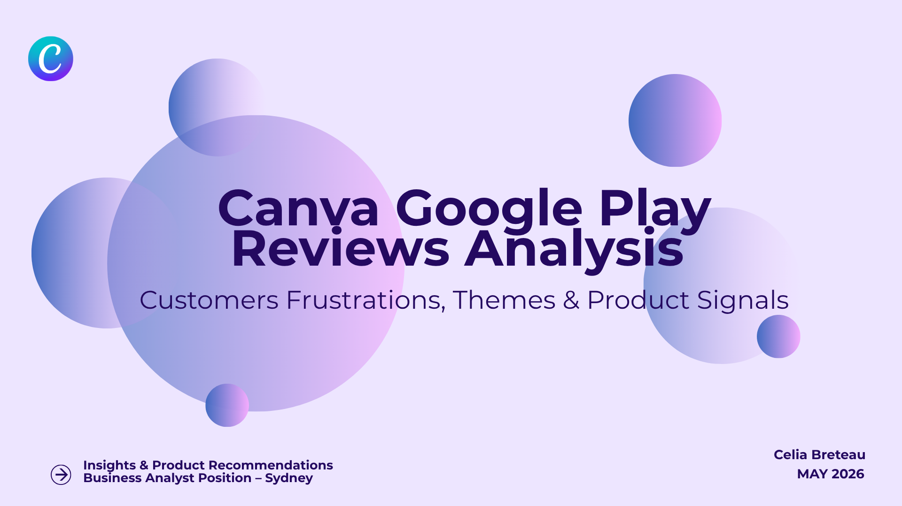

# Canva Google Play Reviews: customers frustrations, themes, and products signals
> 👉 [Looker Studio Dashboard](https://datastudio.google.com/s/n3HPM4JGqG0) · [View Presentation](https://canva.link/x3ne4cxmx5ll0us) · [LinkedIn](www.linkedin.com/in/celia-breteau)

### How do users perceive Canva's app, and where does it fail them?

This project analyses **50,000 Google Play reviews** (Nov 2025 – early April 2026) to uncover what users actually struggle with behind Canva’s 4.7★ rating.

Using a combination of **Python, SQL, and AI clustering techniques**, the analysis identifies recurring pain points, product issues, and patterns of user dissatisfaction at scale.

---

## 💡 Key Findings

| # | Finding | Detail |
|---|---------|--------|
| 1 | **84.7% of reviews are positive** | Strong loyal user base — dataset avg score: 4.4 (vs 4.7★ all-time rating) |
| 2 | **1,223 users are genuinely frustrated** | Negative score + explicit complaint keyword — crashes, bugs, slow performance |
| 3 | **App instability is the #1 pain point** | 607 verbatims — not working, slow, crashes |
| 4 | **Billing issues hidden behind good ratings** | 284 refund/subscription verbatims |
| 5 | **Versions 2.334.0 and 2.337.0 was a problematic release** | ~7% complaint rate vs 4% baseline |
| 6 | **99.7% of responses are automated** | Only 43/13,087 personalised |

---

## Analysis

**Overall perception**

Canva shows a very strong overall perception, with 84.7% of users rating the app positively.

However, a smaller segment (1,223 users), express clear dissatisfaction with explicit complaint keywords.  
This group represents the most actionable signal in the dataset.

---

**What users actually complain about**

SQL keyword analysis and verbatim clustering point to the same conclusion:
performance and stability are Canva's core problem.

The most critical themes include:

| Theme | Negativity Ratio | Volume |
|------|----------------|--------|
| App not working | 1.06 | 607 |
| App instability / slow | 1.10 | 144 |
| Video download performance | 0.81 | 365 |
| Billing & refunds | 0.78 | 284 |

These issues point to a **reliability problem**, not a feature gap.

---

**Which versions generate the most complaints?**

Versions 2.334.0 and 2.337.0 exceed the baseline, reaching nearly 7% negative rate
vs ~4% for typical releases.

---

**Is Canva listening?**

Canva responds to 96.9% of negative reviews, an extremely high response rate.

However:
- 99.7% of responses are automated  
- Only 43 out of 13,087 are personalised

This indicates a scalable but impersonal support strategy.

---
## Recommendations

| Priority | Theme | Recommendation |
|----------|-------|----------------|
| 🔴 Critical | App stability | Investigate the 607 users reporting complete app failure |
| 🔴 Critical | Video performance | Optimise video download and export pipeline |
| 🟠 High | Billing transparency | Notify users clearly before any Pro charge — 284 refund requests suggest surprise billing |
| 🟡 Medium | Mobile UX | Dedicated optimisation pass for mobile experience |
| 🟡 Medium | User support | Move beyond automated responses for high-frustration reviews |

These recommendations focus on improving **product reliability, user trust, and perceived support quality**.

---

## How I Built It

| Step | Tool | File |
|------|------|------|
| Data collection | Python — google-play-scraper | [`scripts/collect_reviews.py`](scripts/collect_reviews.py) |
| Cleaning & features | Python — pandas, regex | [`scripts/clean_reviews.py`](scripts/clean_reviews.py) |
| SQL analysis | SQLite — 3 relational tables | [`sql/analysis.sql`](sql/analysis.sql) |
| Verbatim clustering | Python (embeddings + HDBSCAN, local LLM via Ollama) | [`scripts/cluster_summary.py`](scripts/cluster_summary.py) |
| Visualisation | Data Studio | [Dashboard](https://datastudio.google.com/s/n3HPM4JGqG0) |

---

## ⚠️ Limitations

- **False negatives:** some 1-2 star reviews contain positive 
  language, likely due to inverted rating scales in Asian markets
- **Version dating:** app version numbers used as chronological 
  proxy — no official release dates available
- **English only:** scraper filtered for English reviews — 
  non-English user feedback not captured

---

## 👩‍💻 About This Project

I'm Celia Breteau, a data analyst with 2 years of experience in 
audience analytics and consumer behaviour across 6 industry sectors. 
I combine business instinct with a technical skillset in Python, SQL, 
and AI clustering.

This project was built because I genuinely wanted to understand what 
real users think of Canva — not just the headline rating, but the 
frustration behind it. Understanding customer needs has always been 
at the core of my work, and data is just a more precise way to do it.

Based in Sydney. Open to Data Analyst and Business Intelligence 
roles in tech, media, and consumer insights.
